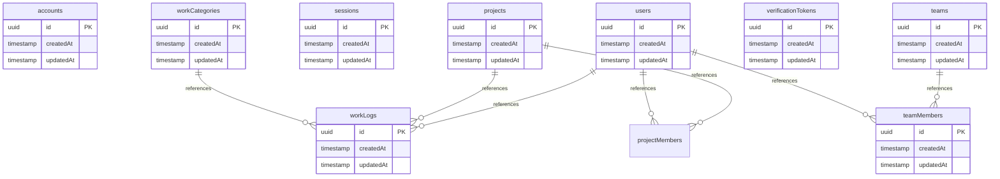

# Database Entity Relationship Diagram

```mermaid
erDiagram

  accounts {
    uuid id PK
    timestamp createdAt
    timestamp updatedAt
  }

  projects {
    uuid id PK
    timestamp createdAt
    timestamp updatedAt
  }

  sessions {
    uuid id PK
    timestamp createdAt
    timestamp updatedAt
  }

  teamMembers {
    uuid id PK
    timestamp createdAt
    timestamp updatedAt
  }

  teams {
    uuid id PK
    timestamp createdAt
    timestamp updatedAt
  }

  users {
    uuid id PK
    timestamp createdAt
    timestamp updatedAt
  }

  verificationTokens {
    uuid id PK
    timestamp createdAt
    timestamp updatedAt
  }

  workCategories {
    uuid id PK
    timestamp createdAt
    timestamp updatedAt
  }

  workLogs {
    uuid id PK
    timestamp createdAt
    timestamp updatedAt
  }

  users ||--o{ workLogs : "references"
  projects ||--o{ workLogs : "references"
  workCategories ||--o{ workLogs : "references"
  teams ||--o{ teamMembers : "references"
  users ||--o{ teamMembers : "references"
  projects ||--o{ projectMembers : "references"
  users ||--o{ projectMembers : "references"
```

