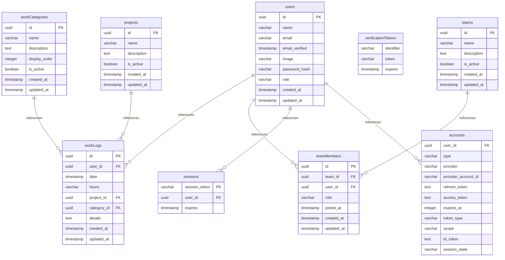

# Database Entity Relationship Diagram

> **自動生成日時**: 2025-11-02T07:02:18.749Z
> **注意**: このファイルは `drizzle/schema.ts` から自動生成されます。直接編集しないでください。
> 
> 再生成: `npm run docs:db:mermaid`

```mermaid
erDiagram

  accounts {
    uuid user_id FK
    varchar type
    varchar provider
    varchar provider_account_id
    text refresh_token
    text access_token
    integer expires_at
    varchar token_type
    varchar scope
    text id_token
    varchar session_state
  }

  projects {
    uuid id PK
    varchar name
    text description
    boolean is_active
    timestamp created_at
    timestamp updated_at
  }

  sessions {
    varchar session_token PK
    uuid user_id FK
    timestamp expires
  }

  teamMembers {
    uuid id PK
    uuid team_id FK
    uuid user_id FK
    varchar role
    timestamp joined_at
    timestamp created_at
    timestamp updated_at
  }

  teams {
    uuid id PK
    varchar name
    text description
    boolean is_active
    timestamp created_at
    timestamp updated_at
  }

  users {
    uuid id PK
    varchar name
    varchar email
    timestamp email_verified
    varchar image
    varchar password_hash
    varchar role
    timestamp created_at
    timestamp updated_at
  }

  verificationTokens {
    varchar identifier
    varchar token
    timestamp expires
  }

  workCategories {
    uuid id PK
    varchar name
    text description
    integer display_order
    boolean is_active
    timestamp created_at
    timestamp updated_at
  }

  workLogs {
    uuid id PK
    uuid user_id FK
    timestamp date
    varchar hours
    uuid project_id FK
    uuid category_id FK
    text details
    timestamp created_at
    timestamp updated_at
  }
  users ||--o{ accounts : "references"
  users ||--o{ sessions : "references"
  users ||--o{ teamMembers : "references"
  users ||--o{ workLogs : "references"
  teams ||--o{ teamMembers : "references"
  projects ||--o{ workLogs : "references"
  workCategories ||--o{ workLogs : "references"
```
