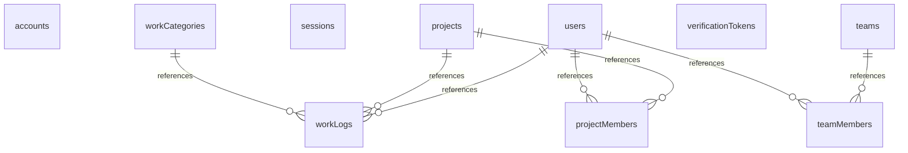

# Database Schema Documentation

Generated: 2025-11-01T11:15:15.470Z

## Overview

This document provides information about the database schema, including tables and relationships.

## Table of Contents

- [accounts](#accounts)
- [projects](#projects)
- [sessions](#sessions)
- [teamMembers](#teammembers)
- [teams](#teams)
- [users](#users)
- [verificationTokens](#verificationtokens)
- [workCategories](#workcategories)
- [workLogs](#worklogs)

---

## accounts

Table: `accounts`

### Common Columns

| Column Name | Data Type | Description |
|-------------|-----------|-------------|
| id | UUID | Primary key |
| createdAt | TIMESTAMP | Creation timestamp |
| updatedAt | TIMESTAMP | Last update timestamp |

---

## projects

Table: `projects`

### Common Columns

| Column Name | Data Type | Description |
|-------------|-----------|-------------|
| id | UUID | Primary key |
| createdAt | TIMESTAMP | Creation timestamp |
| updatedAt | TIMESTAMP | Last update timestamp |

### Additional Columns

- name: Project name
- description: Project description (optional)
- isActive: Active status flag

---

## sessions

Table: `sessions`

### Common Columns

| Column Name | Data Type | Description |
|-------------|-----------|-------------|
| id | UUID | Primary key |
| createdAt | TIMESTAMP | Creation timestamp |
| updatedAt | TIMESTAMP | Last update timestamp |

---

## teamMembers

Table: `teamMembers`

### Common Columns

| Column Name | Data Type | Description |
|-------------|-----------|-------------|
| id | UUID | Primary key |
| createdAt | TIMESTAMP | Creation timestamp |
| updatedAt | TIMESTAMP | Last update timestamp |

### Additional Columns

- teamId: Reference to teams table
- userId: Reference to users table
- role: Team member role

---

## teams

Table: `teams`

### Common Columns

| Column Name | Data Type | Description |
|-------------|-----------|-------------|
| id | UUID | Primary key |
| createdAt | TIMESTAMP | Creation timestamp |
| updatedAt | TIMESTAMP | Last update timestamp |

### Additional Columns

- name: Team name
- description: Team description (optional)
- isActive: Active status flag

---

## users

Table: `users`

### Common Columns

| Column Name | Data Type | Description |
|-------------|-----------|-------------|
| id | UUID | Primary key |
| createdAt | TIMESTAMP | Creation timestamp |
| updatedAt | TIMESTAMP | Last update timestamp |

### Additional Columns

- email: User email address (unique)
- name: User display name
- password: Hashed password
- role: User role (admin, manager, user)

---

## verificationTokens

Table: `verificationTokens`

### Common Columns

| Column Name | Data Type | Description |
|-------------|-----------|-------------|
| id | UUID | Primary key |
| createdAt | TIMESTAMP | Creation timestamp |
| updatedAt | TIMESTAMP | Last update timestamp |

---

## workCategories

Table: `workCategories`

### Common Columns

| Column Name | Data Type | Description |
|-------------|-----------|-------------|
| id | UUID | Primary key |
| createdAt | TIMESTAMP | Creation timestamp |
| updatedAt | TIMESTAMP | Last update timestamp |

### Additional Columns

- name: Category name
- description: Category description (optional)
- displayOrder: Sort order for display
- isActive: Active status flag

---

## workLogs

Table: `workLogs`

### Common Columns

| Column Name | Data Type | Description |
|-------------|-----------|-------------|
| id | UUID | Primary key |
| createdAt | TIMESTAMP | Creation timestamp |
| updatedAt | TIMESTAMP | Last update timestamp |

### Additional Columns

- date: Work date
- hours: Hours worked (decimal)
- description: Work description (optional)
- userId: Reference to users table
- projectId: Reference to projects table
- categoryId: Reference to workCategories table

---

## Relationships Overview

## Statistics

- Total Tables: 9
