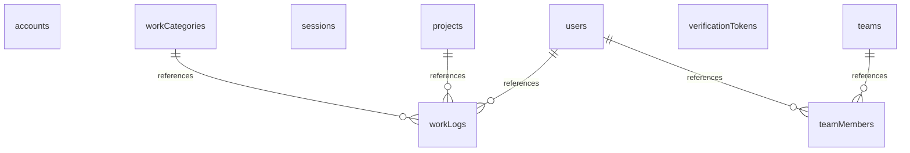

# データベーススキーマドキュメント

生成日時: 2025-11-01T23:35:42.946Z

## 概要

このドキュメントは、データベーススキーマの詳細情報（テーブル構造とリレーション）を提供します。

## 目次

- [accounts](#accounts)
- [projects](#projects)
- [sessions](#sessions)
- [teamMembers](#teammembers)
- [teams](#teams)
- [users](#users)
- [verificationTokens](#verificationtokens)
- [workCategories](#workcategories)
- [workLogs](#worklogs)

---

## accounts

テーブル: `accounts`

### 共通カラム

| カラム名 | データ型 | 説明 |
|---------|---------|------|
| id | UUID | 主キー |
| createdAt | TIMESTAMP | 作成日時 |
| updatedAt | TIMESTAMP | 更新日時 |

---

## projects

テーブル: `projects`

### 共通カラム

| カラム名 | データ型 | 説明 |
|---------|---------|------|
| id | UUID | 主キー |
| createdAt | TIMESTAMP | 作成日時 |
| updatedAt | TIMESTAMP | 更新日時 |

### 追加カラム

- name: プロジェクト名
- description: プロジェクトの説明（任意）
- isActive: 有効状態フラグ

---

## sessions

テーブル: `sessions`

### 共通カラム

| カラム名 | データ型 | 説明 |
|---------|---------|------|
| id | UUID | 主キー |
| createdAt | TIMESTAMP | 作成日時 |
| updatedAt | TIMESTAMP | 更新日時 |

---

## teamMembers

テーブル: `teamMembers`

### 共通カラム

| カラム名 | データ型 | 説明 |
|---------|---------|------|
| id | UUID | 主キー |
| createdAt | TIMESTAMP | 作成日時 |
| updatedAt | TIMESTAMP | 更新日時 |

### 追加カラム

- teamId: チームテーブルへの参照
- userId: ユーザーテーブルへの参照
- role: チームメンバーの役割

---

## teams

テーブル: `teams`

### 共通カラム

| カラム名 | データ型 | 説明 |
|---------|---------|------|
| id | UUID | 主キー |
| createdAt | TIMESTAMP | 作成日時 |
| updatedAt | TIMESTAMP | 更新日時 |

### 追加カラム

- name: チーム名
- description: チームの説明（任意）
- isActive: 有効状態フラグ

---

## users

テーブル: `users`

### 共通カラム

| カラム名 | データ型 | 説明 |
|---------|---------|------|
| id | UUID | 主キー |
| createdAt | TIMESTAMP | 作成日時 |
| updatedAt | TIMESTAMP | 更新日時 |

### 追加カラム

- email: ユーザーのメールアドレス（一意制約）
- name: ユーザーの表示名
- password: ハッシュ化されたパスワード
- role: ユーザーの役割（admin, manager, user）

---

## verificationTokens

テーブル: `verificationTokens`

### 共通カラム

| カラム名 | データ型 | 説明 |
|---------|---------|------|
| id | UUID | 主キー |
| createdAt | TIMESTAMP | 作成日時 |
| updatedAt | TIMESTAMP | 更新日時 |

---

## workCategories

テーブル: `workCategories`

### 共通カラム

| カラム名 | データ型 | 説明 |
|---------|---------|------|
| id | UUID | 主キー |
| createdAt | TIMESTAMP | 作成日時 |
| updatedAt | TIMESTAMP | 更新日時 |

### 追加カラム

- name: カテゴリ名
- description: カテゴリの説明（任意）
- displayOrder: 表示順序
- isActive: 有効状態フラグ

---

## workLogs

テーブル: `workLogs`

### 共通カラム

| カラム名 | データ型 | 説明 |
|---------|---------|------|
| id | UUID | 主キー |
| createdAt | TIMESTAMP | 作成日時 |
| updatedAt | TIMESTAMP | 更新日時 |

### 追加カラム

- date: 作業日
- hours: 作業時間（時間単位）
- description: 作業内容の説明（任意）
- userId: ユーザーテーブルへの参照
- projectId: プロジェクトテーブルへの参照
- categoryId: 作業カテゴリテーブルへの参照

---

## テーブルリレーション

## 統計情報

- テーブル総数: 9
