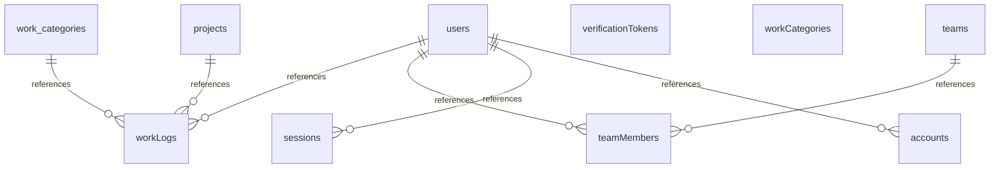

# データベーススキーマドキュメント

> **自動生成日時**: 2025-11-02T21:46:08.491Z
> **注意**: このファイルは `drizzle/schema.ts` から自動生成されます。直接編集しないでください。
> 
> 再生成: `npm run docs:db:markdown`

## 概要

このドキュメントは、Drizzle ORMスキーマから自動生成されたデータベース構造の詳細情報です。

## 目次

- [accounts](#accounts)
- [projects](#projects)
- [sessions](#sessions)
- [teamMembers](#teammembers)
- [teams](#teams)
- [users](#users)
- [verificationTokens](#verificationtokens)
- [workCategories](#workcategories)
- [workLogs](#worklogs)

---

## accounts

テーブル名: `accounts`

### カラム一覧

| カラム名 | データ型 | 説明 |
|---------|---------|------|
| user_id | UUID | ユーザーID（外部キー）（必須） |
| type | VARCHAR | タイプ（必須） |
| provider | VARCHAR | プロバイダー（必須） |
| provider_account_id | VARCHAR | プロバイダーアカウントID（必須） |
| refresh_token | TEXT | リフレッシュトークン |
| access_token | TEXT | アクセストークン |
| expires_at | INTEGER | 有効期限 |
| token_type | VARCHAR | トークンタイプ |
| scope | VARCHAR | スコープ |
| id_token | TEXT | IDトークン |
| session_state | VARCHAR | セッション状態 |

### 外部キー制約

- `user_id` → `users(id)`

---

## projects

テーブル名: `projects`

### カラム一覧

| カラム名 | データ型 | 説明 |
|---------|---------|------|
| id | UUID | 主キー（必須、デフォルト値あり、主キー） |
| name | VARCHAR | 名前（必須、一意制約） |
| description | TEXT | 説明 |
| is_active | BOOLEAN | 有効状態（必須、デフォルト値あり） |
| created_at | TIMESTAMP | 作成日時（必須、デフォルト値あり） |
| updated_at | TIMESTAMP | 更新日時（必須、デフォルト値あり） |

### インデックス

- `projects_is_active_idx`: INDEX (is_active)

---

## sessions

テーブル名: `sessions`

### カラム一覧

| カラム名 | データ型 | 説明 |
|---------|---------|------|
| session_token | VARCHAR | セッショントークン（必須、主キー） |
| user_id | UUID | ユーザーID（外部キー）（必須） |
| expires | TIMESTAMP | 有効期限（必須） |

### 外部キー制約

- `user_id` → `users(id)`

---

## teamMembers

テーブル名: `team_members`

### カラム一覧

| カラム名 | データ型 | 説明 |
|---------|---------|------|
| id | UUID | 主キー（必須、デフォルト値あり、主キー） |
| team_id | UUID | チームID（外部キー）（必須） |
| user_id | UUID | ユーザーID（外部キー）（必須） |
| role | VARCHAR | 役割・権限（必須、デフォルト値あり） |
| joined_at | TIMESTAMP | 参加日時（必須、デフォルト値あり） |
| created_at | TIMESTAMP | 作成日時（必須、デフォルト値あり） |
| updated_at | TIMESTAMP | 更新日時（必須、デフォルト値あり） |

### インデックス

- `team_members_team_user_idx`: INDEX (team_id, user_id)
- `team_members_user_idx`: INDEX (user_id)

### 外部キー制約

- `team_id` → `teams(id)`
- `user_id` → `users(id)`

---

## teams

テーブル名: `teams`

### カラム一覧

| カラム名 | データ型 | 説明 |
|---------|---------|------|
| id | UUID | 主キー（必須、デフォルト値あり、主キー） |
| name | VARCHAR | 名前（必須、一意制約） |
| description | TEXT | 説明 |
| is_active | BOOLEAN | 有効状態（必須、デフォルト値あり） |
| created_at | TIMESTAMP | 作成日時（必須、デフォルト値あり） |
| updated_at | TIMESTAMP | 更新日時（必須、デフォルト値あり） |

### インデックス

- `teams_is_active_idx`: INDEX (is_active)

---

## users

テーブル名: `users`

### カラム一覧

| カラム名 | データ型 | 説明 |
|---------|---------|------|
| id | UUID | 主キー（必須、デフォルト値あり、主キー） |
| name | VARCHAR | 名前 |
| email | VARCHAR | メールアドレス（必須、一意制約） |
| email_verified | TIMESTAMP | メール確認日時 |
| image | VARCHAR | 画像URL |
| password_hash | VARCHAR | パスワードハッシュ |
| role | VARCHAR | 役割・権限（必須、デフォルト値あり） |
| created_at | TIMESTAMP | 作成日時（必須、デフォルト値あり） |
| updated_at | TIMESTAMP | 更新日時（必須、デフォルト値あり） |

---

## verificationTokens

テーブル名: `verification_tokens`

### カラム一覧

| カラム名 | データ型 | 説明 |
|---------|---------|------|
| identifier | VARCHAR | 識別子（必須） |
| token | VARCHAR | トークン（必須、一意制約） |
| expires | TIMESTAMP | 有効期限（必須） |

---

## workCategories

テーブル名: `work_categories`

### カラム一覧

| カラム名 | データ型 | 説明 |
|---------|---------|------|
| id | UUID | 主キー（必須、デフォルト値あり、主キー） |
| name | VARCHAR | 名前（必須、一意制約） |
| description | TEXT | 説明 |
| display_order | INTEGER | 表示順序（必須、デフォルト値あり） |
| is_active | BOOLEAN | 有効状態（必須、デフォルト値あり） |
| created_at | TIMESTAMP | 作成日時（必須、デフォルト値あり） |
| updated_at | TIMESTAMP | 更新日時（必須、デフォルト値あり） |

### インデックス

- `work_categories_is_active_display_order_idx`: INDEX (is_active, display_order)

---

## workLogs

テーブル名: `work_logs`

### カラム一覧

| カラム名 | データ型 | 説明 |
|---------|---------|------|
| id | UUID | 主キー（必須、デフォルト値あり、主キー） |
| user_id | UUID | ユーザーID（外部キー）（必須） |
| date | TIMESTAMP | 日付（必須） |
| hours | VARCHAR | 作業時間（必須） |
| project_id | UUID | プロジェクトID（外部キー）（必須） |
| category_id | UUID | カテゴリID（外部キー）（必須） |
| details | TEXT | 詳細 |
| created_at | TIMESTAMP | 作成日時（必須、デフォルト値あり） |
| updated_at | TIMESTAMP | 更新日時（必須、デフォルト値あり） |

### インデックス

- `work_logs_user_id_date_idx`: INDEX (user_id, date)
- `work_logs_project_id_idx`: INDEX (project_id)
- `work_logs_category_id_idx`: INDEX (category_id)
- `work_logs_date_user_idx`: INDEX (date, user_id)
- `work_logs_project_category_idx`: INDEX (project_id, category_id)
- `work_logs_details_gin_idx`: INDEX (expression)

### 外部キー制約

- `user_id` → `users(id)`
- `project_id` → `projects(id)`
- `category_id` → `work_categories(id)`

---

## テーブルリレーション

## 統計情報

- テーブル総数: 9
- カラム総数: 61
- インデックス総数: 11
- 外部キー総数: 7
