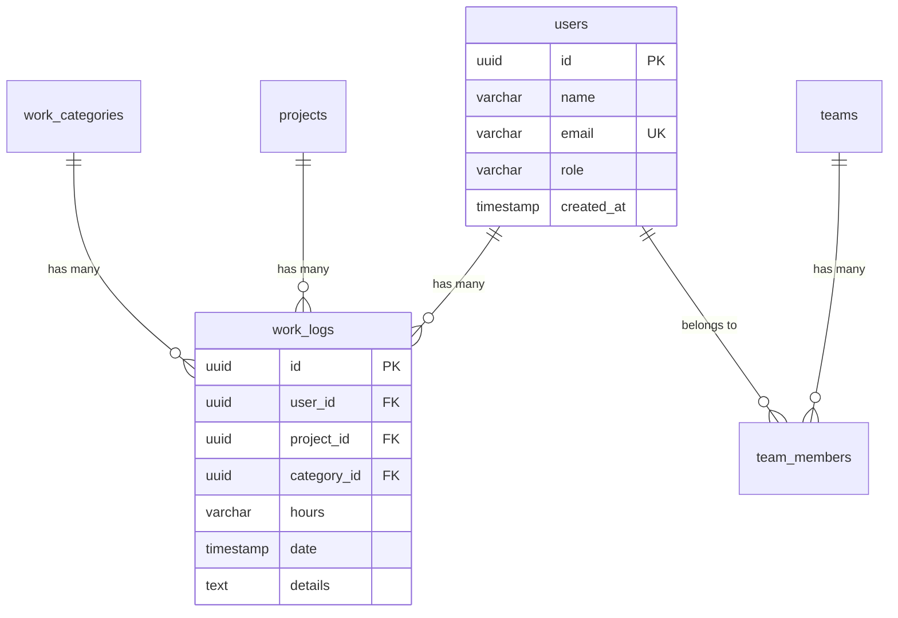

# データベースドキュメント自動生成機能 設計書

## 概要

Drizzle ORMスキーマから、データベース定義書とER図を自動生成する機能を実装する。
コマンド一つで以下を生成：
- **DBML形式のスキーマ定義**（dbdiagram.io互換）
- **Mermaid形式のER図**（Markdown埋め込み可能）
- **マークダウン形式のデータベース定義書**
- **インタラクティブなER図ビューア**（Drizzle Studio統合）

## 目的

### ユーザーのニーズ
1. **データベース定義書の自動生成**
   - 手動でのDB設計書作成・更新の負担削減
   - スキーマ変更時のドキュメント更新漏れ防止
   - 新メンバーへのオンボーディング資料として活用

2. **ER図の自動生成とビジュアライゼーション**
   - テーブル間の関係性を視覚的に理解
   - データモデルの全体像を把握
   - 設計レビューやディスカッションに活用

3. **コマンド一つで生成可能**
   - `npm run db:docs` で即座に生成
   - CI/CDパイプラインへの統合
   - Git管理によるバージョントラッキング

## 2025年のベストプラクティス

### Single Source of Truth原則
- Drizzle ORMスキーマ（`drizzle/schema.ts`）を唯一の真実の情報源とする
- すべてのドキュメントはスキーマから自動生成
- 手動編集を最小限に抑える

### モダンなツールチェーン
1. **Drizzle Kit** - 組み込みのスキーマビジュアライゼーション
2. **drizzle-dbml-generator** - DBML生成
3. **カスタムスクリプト** - Mermaid ERD & Markdown生成
4. **Drizzle Studio** - インタラクティブなスキーマブラウザ

### Git-Friendly Documentation
- Markdown形式でのドキュメント生成
- Mermaid図をMarkdownに埋め込み
- GitHub/GitLabで直接表示可能
- バージョン管理が容易

## 技術選定

### 採用ツール

#### 1. Drizzle DBML Generator
```bash
npm install -D drizzle-dbml-generator
```

**選定理由:**
- Drizzle ORMスキーマから直接DBML生成
- PostgreSQL, MySQL, SQLiteに対応
- dbdiagram.io でビジュアライゼーション可能
- 軽量でメンテナンスされている

**用途:**
- DBML形式のスキーマエクスポート
- dbdiagram.io での共有・コラボレーション
- 外部ツールとの連携

#### 2. Drizzle Studio
```bash
npm run db:studio
```

**選定理由:**
- Drizzle公式のデータベースGUIツール
- スキーマビジュアライゼーション機能内蔵
- データブラウジング・編集も可能
- すでにプロジェクトに組み込み済み

**用途:**
- 開発中のインタラクティブなスキーマ確認
- データの確認・デバッグ

#### 3. カスタムスクリプト（Node.js/TypeScript）

**選定理由:**
- Mermaid ERD生成には専用スクリプトが必要
- Markdownドキュメント生成をカスタマイズ可能
- プロジェクト固有の要件に対応

**用途:**
- Mermaid ERD生成
- Markdown形式のDB定義書生成
- スキーマメタデータの抽出

### 生成フォーマット

#### 1. DBML（Database Markup Language）
```dbml
Table users {
  id uuid [pk]
  name varchar(255) [not null]
  email varchar(255) [not null, unique]
  role varchar(50) [not null, default: 'user']
  created_at timestamp [not null, default: `now()`]
}

Table work_logs {
  id uuid [pk]
  user_id uuid [not null, ref: > users.id]
  project_id uuid [not null, ref: > projects.id]
  hours varchar(10) [not null]
  date timestamp [not null]
}
```

**利点:**
- dbdiagram.io で即座にER図表示
- 人間が読みやすい
- 他のツールとの互換性

#### 2. Mermaid ERD


**利点:**
- GitHubのMarkdownで直接表示
- Markdown内に埋め込み可能
- プレーンテキストでバージョン管理

#### 3. Markdown形式のDB定義書
```markdown
# データベース定義書

## テーブル一覧

### users（ユーザー）

**説明:** システムユーザー情報

| カラム名 | 型 | 制約 | デフォルト | 説明 |
|---------|-----|------|-----------|------|
| id | uuid | PK | - | ユーザーID |
| name | varchar(255) | - | - | 氏名 |
| email | varchar(255) | NOT NULL, UNIQUE | - | メールアドレス |
| role | varchar(50) | NOT NULL | 'user' | 役割（admin/manager/user） |
| created_at | timestamp | NOT NULL | now() | 作成日時 |

**インデックス:**
- PRIMARY KEY (id)
- UNIQUE (email)

**リレーション:**
- work_logs.user_id → users.id (1:N)
- team_members.user_id → users.id (1:N)
```

**利点:**
- 日本語での詳細説明が可能
- テーブル定義を一覧で確認
- 印刷・PDF化に適している

## アーキテクチャ設計

### ディレクトリ構造

```
work-management/
├── drizzle/
│   └── schema.ts                 # Single Source of Truth
├── docs/
│   ├── database/
│   │   ├── README.md            # DB定義書（自動生成）
│   │   ├── schema.dbml          # DBML形式（自動生成）
│   │   ├── er-diagram.md        # Mermaid ERD（自動生成）
│   │   └── tables/              # テーブル別詳細（自動生成）
│   │       ├── users.md
│   │       ├── projects.md
│   │       ├── work_logs.md
│   │       └── teams.md
│   └── design/
├── scripts/
│   ├── generate-db-docs.ts      # DB定義書生成スクリプト
│   ├── generate-dbml.ts         # DBML生成スクリプト
│   ├── generate-mermaid-erd.ts  # Mermaid ERD生成スクリプト
│   └── utils/
│       ├── schema-parser.ts     # スキーマ解析ユーティリティ
│       └── markdown-builder.ts  # Markdown生成ヘルパー
├── package.json
└── drizzle.config.ts
```

### データフロー

```
drizzle/schema.ts (Single Source of Truth)
    ↓
    ├─→ Drizzle DBML Generator → docs/database/schema.dbml → dbdiagram.io
    ├─→ generate-mermaid-erd.ts → docs/database/er-diagram.md (Mermaid)
    ├─→ generate-db-docs.ts → docs/database/README.md (Markdown)
    └─→ Drizzle Studio → Interactive Schema Browser (localhost:4983)
```

## 実装設計

### 1. DBML生成スクリプト

#### scripts/generate-dbml.ts

```typescript
import { pgGenerate } from "drizzle-dbml-generator";
import * as schema from "../drizzle/schema";
import { writeFileSync } from "fs";
import { join } from "path";

async function generateDBML() {
  console.log("🔄 Generating DBML from Drizzle schema...");

  const dbml = await pgGenerate({
    schema,
    out: "./docs/database/schema.dbml",
    relational: true, // Use relations from Drizzle
  });

  console.log("✅ DBML generated successfully!");
  console.log("📁 Output: docs/database/schema.dbml");
  console.log("\n💡 View at: https://dbdiagram.io/d");
  console.log("   (Upload schema.dbml to visualize)");
}

generateDBML().catch(console.error);
```

### 2. Mermaid ERD生成スクリプト

#### scripts/generate-mermaid-erd.ts

```typescript
import * as schema from "../drizzle/schema";
import { writeFileSync, mkdirSync } from "fs";
import { join } from "path";

interface Table {
  name: string;
  columns: Column[];
  relations: Relation[];
}

interface Column {
  name: string;
  type: string;
  isPrimaryKey: boolean;
  isForeignKey: boolean;
  isUnique: boolean;
  isNotNull: boolean;
}

interface Relation {
  fromTable: string;
  fromColumn: string;
  toTable: string;
  toColumn: string;
  cardinality: "one-to-one" | "one-to-many" | "many-to-many";
}

function parseSchema(schema: any): Table[] {
  // Drizzle スキーマを解析してテーブル情報を抽出
  const tables: Table[] = [];

  for (const [key, value] of Object.entries(schema)) {
    if (value && typeof value === "object" && "tableName" in value) {
      // テーブルの解析
      const table = parseTable(key, value);
      tables.push(table);
    }
  }

  return tables;
}

function generateMermaidERD(tables: Table[]): string {
  let mermaid = "```mermaid\nerDiagram\n";

  // リレーションの追加
  const relations = extractRelations(tables);
  for (const rel of relations) {
    const cardinalitySymbol = getCardinalitySymbol(rel.cardinality);
    mermaid += `    ${rel.fromTable} ${cardinalitySymbol} ${rel.toTable} : "${rel.description}"\n`;
  }

  mermaid += "\n";

  // テーブル定義の追加
  for (const table of tables) {
    mermaid += `    ${table.name} {\n`;
    for (const col of table.columns) {
      const constraints = [];
      if (col.isPrimaryKey) constraints.push("PK");
      if (col.isForeignKey) constraints.push("FK");
      if (col.isUnique) constraints.push("UK");

      const constraintStr = constraints.length > 0 ? ` ${constraints.join(",")}` : "";
      mermaid += `        ${col.type} ${col.name}${constraintStr}\n`;
    }
    mermaid += `    }\n\n`;
  }

  mermaid += "```\n";
  return mermaid;
}

function getCardinalitySymbol(cardinality: string): string {
  switch (cardinality) {
    case "one-to-one": return "||--||";
    case "one-to-many": return "||--o{";
    case "many-to-many": return "}o--o{";
    default: return "||--o{";
  }
}

async function main() {
  console.log("🔄 Generating Mermaid ERD from Drizzle schema...");

  const tables = parseSchema(schema);
  const mermaidERD = generateMermaidERD(tables);

  // ER図を保存
  const outputPath = join(process.cwd(), "docs/database/er-diagram.md");
  mkdirSync(join(process.cwd(), "docs/database"), { recursive: true });

  const content = `# Entity Relationship Diagram

${mermaidERD}

## 凡例

- **PK**: Primary Key (主キー)
- **FK**: Foreign Key (外部キー)
- **UK**: Unique Key (ユニークキー)

## リレーションシップ

- \`||\`: 必須（1）
- \`o{\`: 任意（0以上）
- \`}o\`: 多対多

---

**自動生成日時:** ${new Date().toISOString()}
**生成元:** \`drizzle/schema.ts\`
**生成コマンド:** \`npm run db:docs\`
`;

  writeFileSync(outputPath, content, "utf-8");

  console.log("✅ Mermaid ERD generated successfully!");
  console.log("📁 Output: docs/database/er-diagram.md");
  console.log("\n💡 View on GitHub to see the rendered diagram");
}

main().catch(console.error);
```

### 3. Markdownドキュメント生成スクリプト

#### scripts/generate-db-docs.ts

```typescript
import * as schema from "../drizzle/schema";
import { writeFileSync, mkdirSync } from "fs";
import { join } from "path";

interface TableDoc {
  tableName: string;
  description: string;
  columns: ColumnDoc[];
  indexes: IndexDoc[];
  relations: RelationDoc[];
}

interface ColumnDoc {
  name: string;
  type: string;
  constraints: string[];
  defaultValue?: string;
  description: string;
}

function generateTableMarkdown(table: TableDoc): string {
  let md = `# ${table.tableName}\n\n`;
  md += `${table.description}\n\n`;

  md += `## カラム定義\n\n`;
  md += `| カラム名 | 型 | 制約 | デフォルト | 説明 |\n`;
  md += `|---------|-----|------|-----------|------|\n`;

  for (const col of table.columns) {
    const constraints = col.constraints.join(", ") || "-";
    const defaultVal = col.defaultValue || "-";
    md += `| ${col.name} | ${col.type} | ${constraints} | ${defaultVal} | ${col.description} |\n`;
  }

  md += `\n## インデックス\n\n`;
  for (const idx of table.indexes) {
    md += `- ${idx.name}: (${idx.columns.join(", ")})\n`;
  }

  md += `\n## リレーション\n\n`;
  for (const rel of table.relations) {
    md += `- **${rel.type}**: ${rel.description}\n`;
  }

  md += `\n---\n\n`;
  md += `**自動生成日時:** ${new Date().toISOString()}\n`;

  return md;
}

function generateIndexMarkdown(tables: TableDoc[]): string {
  let md = `# データベース定義書\n\n`;
  md += `**プロジェクト:** Work Management System\n`;
  md += `**データベース:** PostgreSQL (Vercel Postgres)\n`;
  md += `**ORM:** Drizzle ORM\n\n`;

  md += `## 概要\n\n`;
  md += `このドキュメントは \`drizzle/schema.ts\` から自動生成されています。\n\n`;

  md += `## テーブル一覧\n\n`;
  md += `| テーブル名 | 説明 | レコード数目安 |\n`;
  md += `|-----------|------|-------------|\n`;

  for (const table of tables) {
    md += `| [${table.tableName}](./tables/${table.tableName}.md) | ${table.description} | - |\n`;
  }

  md += `\n## ER図\n\n`;
  md += `詳細なER図は [er-diagram.md](./er-diagram.md) を参照してください。\n\n`;

  md += `## DBML形式\n\n`;
  md += `DBML形式のスキーマは [schema.dbml](./schema.dbml) を参照してください。\n`;
  md += `[dbdiagram.io](https://dbdiagram.io/d) にアップロードして視覚化できます。\n\n`;

  md += `## 更新履歴\n\n`;
  md += `| 日付 | バージョン | 変更内容 |\n`;
  md += `|------|-----------|----------|\n`;
  md += `| ${new Date().toISOString().split('T')[0]} | 1.0.0 | 初版作成 |\n\n`;

  md += `---\n\n`;
  md += `**最終更新:** ${new Date().toISOString()}\n`;
  md += `**生成コマンド:** \`npm run db:docs\`\n`;

  return md;
}

async function main() {
  console.log("🔄 Generating database documentation...");

  const tables = parseSchema(schema);

  // ディレクトリ作成
  const docsDir = join(process.cwd(), "docs/database");
  const tablesDir = join(docsDir, "tables");
  mkdirSync(tablesDir, { recursive: true });

  // インデックスページ生成
  const indexMd = generateIndexMarkdown(tables);
  writeFileSync(join(docsDir, "README.md"), indexMd, "utf-8");

  // テーブル別ドキュメント生成
  for (const table of tables) {
    const tableMd = generateTableMarkdown(table);
    writeFileSync(join(tablesDir, `${table.tableName}.md`), tableMd, "utf-8");
  }

  console.log("✅ Database documentation generated successfully!");
  console.log(`📁 Generated ${tables.length} table documents`);
  console.log("📁 Output: docs/database/");
}

main().catch(console.error);
```

### 4. 統合生成スクリプト

#### scripts/generate-all-db-docs.ts

```typescript
import { execSync } from "child_process";

async function generateAllDocs() {
  console.log("🚀 Generating all database documentation...\n");

  const tasks = [
    { name: "DBML Schema", command: "tsx scripts/generate-dbml.ts" },
    { name: "Mermaid ERD", command: "tsx scripts/generate-mermaid-erd.ts" },
    { name: "Markdown Docs", command: "tsx scripts/generate-db-docs.ts" },
  ];

  for (const task of tasks) {
    console.log(`📝 ${task.name}...`);
    try {
      execSync(task.command, { stdio: "inherit" });
    } catch (error) {
      console.error(`❌ Failed to generate ${task.name}`);
      throw error;
    }
  }

  console.log("\n✨ All database documentation generated successfully!");
  console.log("\n📂 Output:");
  console.log("   - docs/database/README.md");
  console.log("   - docs/database/schema.dbml");
  console.log("   - docs/database/er-diagram.md");
  console.log("   - docs/database/tables/*.md");
  console.log("\n💡 Next steps:");
  console.log("   1. Review generated docs in docs/database/");
  console.log("   2. Upload schema.dbml to https://dbdiagram.io/d");
  console.log("   3. View er-diagram.md on GitHub to see Mermaid rendering");
  console.log("   4. Open Drizzle Studio: npm run db:studio");
}

generateAllDocs().catch((error) => {
  console.error("❌ Documentation generation failed:", error);
  process.exit(1);
});
```

## npm Scripts

### package.json

```json
{
  "scripts": {
    "db:docs": "tsx scripts/generate-all-db-docs.ts",
    "db:docs:dbml": "tsx scripts/generate-dbml.ts",
    "db:docs:mermaid": "tsx scripts/generate-mermaid-erd.ts",
    "db:docs:markdown": "tsx scripts/generate-db-docs.ts",
    "db:studio": "drizzle-kit studio",
    "db:generate": "drizzle-kit generate",
    "db:migrate": "drizzle-kit migrate",
    "build": "npm run db:docs && next build"
  },
  "devDependencies": {
    "drizzle-dbml-generator": "^latest",
    "drizzle-kit": "^latest",
    "tsx": "^latest"
  }
}
```

## 使用方法

### コマンド一覧

```bash
# すべてのDB ドキュメントを一括生成
npm run db:docs

# 個別に生成
npm run db:docs:dbml      # DBML形式のみ
npm run db:docs:mermaid   # Mermaid ERDのみ
npm run db:docs:markdown  # Markdownドキュメントのみ

# Drizzle Studioでインタラクティブに確認
npm run db:studio
# → http://localhost:4983
```

### CI/CD統合

#### GitHub Actions ワークフロー

```yaml
# .github/workflows/db-docs.yml

name: Generate Database Documentation

on:
  push:
    branches:
      - main
    paths:
      - 'drizzle/schema.ts'
  pull_request:
    paths:
      - 'drizzle/schema.ts'

jobs:
  generate-docs:
    runs-on: ubuntu-latest
    steps:
      - uses: actions/checkout@v4

      - name: Setup Node.js
        uses: actions/setup-node@v4
        with:
          node-version: '20'
          cache: 'npm'

      - name: Install dependencies
        run: npm ci

      - name: Generate database documentation
        run: npm run db:docs

      - name: Check for changes
        id: changes
        run: |
          git diff --exit-code docs/database/ || echo "changed=true" >> $GITHUB_OUTPUT

      - name: Commit and push if changed
        if: steps.changes.outputs.changed == 'true' && github.event_name == 'push'
        run: |
          git config --local user.email "github-actions[bot]@users.noreply.github.com"
          git config --local user.name "github-actions[bot]"
          git add docs/database/
          git commit -m "docs: update database documentation [skip ci]"
          git push

      - name: Comment on PR if changed
        if: steps.changes.outputs.changed == 'true' && github.event_name == 'pull_request'
        uses: actions/github-script@v7
        with:
          script: |
            github.rest.issues.createComment({
              issue_number: context.issue.number,
              owner: context.repo.owner,
              repo: context.repo.repo,
              body: '⚠️ Database schema has changed. Please run `npm run db:docs` locally and commit the updated documentation.'
            })
```

## ベストプラクティス

### 1. スキーマにコメントを追加

```typescript
// drizzle/schema.ts

export const users = pgTable("users", {
  id: uuid("id").primaryKey().defaultRandom(),

  // 基本情報
  name: varchar("name", { length: 255 }),
  email: varchar("email", { length: 255 }).notNull().unique(),

  // 権限管理
  role: varchar("role", { length: 50 }).notNull().default("user"), // 'admin', 'manager', 'user'

  // タイムスタンプ
  createdAt: timestamp("created_at", { mode: "date" }).notNull().defaultNow(),
  updatedAt: timestamp("updated_at", { mode: "date" }).notNull().defaultNow(),
});

/**
 * ユーザーテーブル
 *
 * システム利用者の基本情報を管理
 * NextAuth.js v5の認証と連携
 */
```

### 2. リレーションを明示的に定義

```typescript
export const usersRelations = relations(users, ({ many }) => ({
  workLogs: many(workLogs),
  teamMemberships: many(teamMembers),
}));

export const workLogsRelations = relations(workLogs, ({ one }) => ({
  user: one(users, {
    fields: [workLogs.userId],
    references: [users.id],
  }),
  project: one(projects, {
    fields: [workLogs.projectId],
    references: [projects.id],
  }),
}));
```

### 3. 定期的なドキュメント更新

```bash
# スキーマ変更後は必ず実行
git add drizzle/schema.ts
npm run db:docs
git add docs/database/
git commit -m "feat: update user table schema with new column"
```

### 4. プルリクエストでのレビュー

- スキーマ変更のPRには必ずドキュメントの更新を含める
- ER図の差分を確認して、意図しないリレーション変更がないかチェック
- CI で自動生成されたドキュメントと手動変更がコンフリクトしないように注意

## セキュリティ考慮事項

### 1. 機密情報の除外

```typescript
// パスワードハッシュなどはドキュメントに含めない
export const users = pgTable("users", {
  id: uuid("id").primaryKey(),
  email: varchar("email", { length: 255 }).notNull(),
  passwordHash: varchar("password_hash", { length: 255 }), // ⚠️ 非公開
});
```

生成スクリプトで特定カラムを除外：

```typescript
const EXCLUDED_COLUMNS = ["password_hash", "api_key", "secret"];

function shouldIncludeColumn(columnName: string): boolean {
  return !EXCLUDED_COLUMNS.includes(columnName);
}
```

### 2. 公開範囲の制御

```markdown
# docs/database/README.md

⚠️ **注意事項**

このドキュメントには本番環境のデータベース構造が含まれています。
外部への共有は禁止です。
```

## パフォーマンス最適化

### 1. 増分生成

```typescript
// スキーマが変更された場合のみ再生成
import { statSync } from "fs";

function needsRegeneration(): boolean {
  const schemaTime = statSync("drizzle/schema.ts").mtimeMs;
  const docsTime = statSync("docs/database/README.md").mtimeMs;
  return schemaTime > docsTime;
}
```

### 2. 並列生成

```typescript
import { execSync } from "child_process";

async function generateInParallel() {
  await Promise.all([
    exec("tsx scripts/generate-dbml.ts"),
    exec("tsx scripts/generate-mermaid-erd.ts"),
    exec("tsx scripts/generate-db-docs.ts"),
  ]);
}
```

## トラブルシューティング

### よくある問題

#### 1. DBMLが正しく生成されない

**原因:** リレーションが定義されていない

**解決策:**
```typescript
// relations を必ず定義
export const usersRelations = relations(users, ({ many }) => ({
  workLogs: many(workLogs),
}));
```

#### 2. Mermaid図が表示されない

**原因:** GitHubのMarkdownレンダリングの問題

**解決策:**
- ブラウザでページを更新
- Mermaid Live Editor で確認: https://mermaid.live/

#### 3. 型情報が取得できない

**原因:** スキーマのexportが不足

**解決策:**
```typescript
// すべてのテーブルをexport
export const users = pgTable(...);
export const projects = pgTable(...);
```

## まとめ

このデータベースドキュメント自動生成機能により、以下が実現されます:

✅ **コマンド一つでDB定義書とER図を生成**
✅ **Single Source of Truth原則の徹底**
✅ **Git-Friendlyなドキュメント管理**
✅ **複数フォーマットでの出力（DBML, Mermaid, Markdown）**
✅ **CI/CDパイプラインへの統合**
✅ **Drizzle Studioによるインタラクティブな確認**
✅ **ドキュメントとコードの同期保証**

### 2025年のベストプラクティスに準拠

- ✅ **TypeScript-First**: 型安全なスキーマ定義
- ✅ **Infrastructure as Code**: スキーマもコード管理
- ✅ **Automation**: 手動作業の最小化
- ✅ **Version Control**: Gitでのドキュメントバージョン管理
- ✅ **Developer Experience**: コマンド一つで実行可能
- ✅ **Collaboration**: 複数形式での共有・レビュー

---

**作成日:** 2024-10-26
**バージョン:** 1.0
**対象:** Drizzle ORM + PostgreSQL
