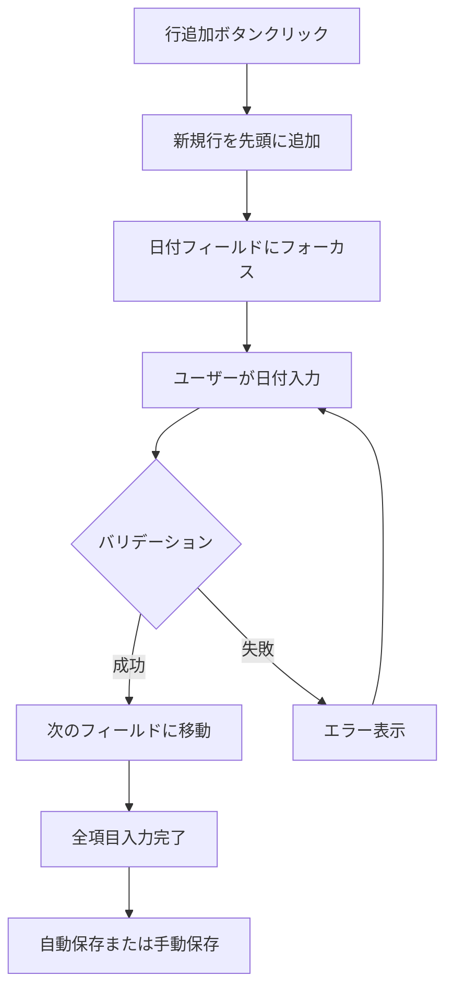
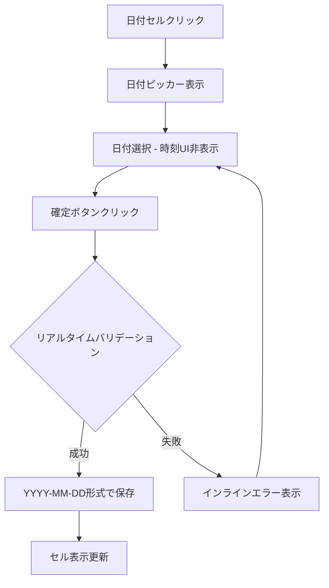
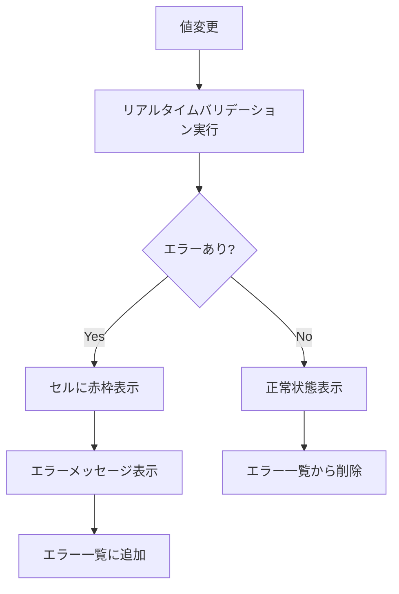

# Work Logs管理画面設計書 v2.0

## 📋 画面概要

| 項目 | 詳細 |
|------|------|
| **画面名** | 作業ログ管理画面 |
| **画面ID** | SCREEN_WORK_LOGS_001 |
| **URL** | `/work-logs` |
| **バージョン** | v2.0 |
| **最終更新日** | 2024-10-11 |
| **作成者** | Claude Code |
| **承認者** | - |

## 🎯 画面目的

日次作業ログの入力・編集・管理を効率的に行うことで、プロジェクト管理と工数管理を支援する。特に以下の機能を重視：

1. **正確な日付入力**: 時刻情報を除外した日付のみの管理
2. **効率的なデータ入力**: Excel風の操作感での一括編集
3. **データ品質保証**: リアルタイムバリデーションによる入力ミス防止

## 🖥️ 画面レイアウト

### メイン画面構成

```
┌─────────────────────────────────────────────────────────────────────────────────┐
│ 🏠 Work Management                                                               │
│ ────────────────────────────────────────────────────────────────────────────── │
│ 📝 作業ログ管理                                                                   │
└─────────────────────────────────────────────────────────────────────────────────┘

┌─────────────────────────────────────────────────────────────────────────────────┐
│ 📊 ダッシュボード情報                                                               │
│ ┌─────────────┬─────────────┬─────────────┬─────────────────────────────────────┐ │
│ │ 📅 今日      │ 📆 今週      │ 📈 今月      │ ⚠️ バリデーションエラー              │ │
│ │ 8.0h        │ 40.5h       │ 152.0h      │ 2件のエラーがあります                │ │
│ └─────────────┴─────────────┴─────────────┴─────────────────────────────────────┘ │
└─────────────────────────────────────────────────────────────────────────────────┘

┌─────────────────────────────────────────────────────────────────────────────────┐
│ 🔧 ツールバー                                                                     │
│ ┌─────────────────────────────────────────────────────────────────────────────┐ │
│ │ [➕ 行追加] [📋 行複製] [🗑️ 行削除] │ [💾 保存] [🔄 更新] │ [📤 エクスポート] │ │
│ └─────────────────────────────────────────────────────────────────────────────┘ │
│ ┌─────────────────────────────────────────────────────────────────────────────┐ │
│ │ 💡 Ctrl+C: コピー | Ctrl+V: ペースト | Ctrl+Z: 元に戻す | Ctrl+Y: やり直し   │ │
│ └─────────────────────────────────────────────────────────────────────────────┘ │
└─────────────────────────────────────────────────────────────────────────────────┘

┌─────────────────────────────────────────────────────────────────────────────────┐
│ 📋 AG Grid データテーブル                                                         │
│ ┌─────────────┬─────────┬──────────────┬──────────────┬─────────────────────────┐ │
│ │ ☑️          │ 📅 日付  │ ⏰ 時間(h)   │ 📂 プロジェクト│ 🏷️ カテゴリ             │ │
│ ├─────────────┼─────────┼──────────────┼──────────────┼─────────────────────────┤ │
│ │ ☑️          │2024-10-11│ 8.0          │プロジェクトA   │開発                     │ │
│ │ ☐           │2024-10-10│ 6.5          │プロジェクトB   │会議                     │ │
│ │ ☐           │[新規行] │ [0.0]        │[選択...]      │[選択...]                │ │
│ └─────────────┴─────────┴──────────────┴──────────────┴─────────────────────────┘ │
│ ┌──────────────────────────────────────────────────────────────────────────────┐ │
│ │ 📝 説明                                                                       │ │
│ ├──────────────────────────────────────────────────────────────────────────────┤ │
│ │ ログイン機能の実装とテストケース作成                                           │ │
│ │ プロジェクト進捗会議とタスク調整                                              │ │
│ │ [テキスト入力エリア...]                                                       │ │
│ └──────────────────────────────────────────────────────────────────────────────┘ │
└─────────────────────────────────────────────────────────────────────────────────┘

┌─────────────────────────────────────────────────────────────────────────────────┐
│ ⚠️ バリデーションエラー表示                                                        │
│ ┌─────────────────────────────────────────────────────────────────────────────┐ │
│ │ 🔴 以下の項目にエラーがあります:                                             │ │
│ │ • 3行目 日付: 有効な日付を入力してください (現在値: 2024-13-45)               │ │
│ │ • 5行目 時間: 時間は0以上24以下で入力してください (現在値: 25.0)              │ │
│ └─────────────────────────────────────────────────────────────────────────────┘ │
└─────────────────────────────────────────────────────────────────────────────────┘
```

## 🔍 フィールド詳細設計

### 1. 日付フィールド（修正対象）

#### 🎯 修正前の問題
```
❌ 問題のある状態:
┌─────────────────────────────────────────┐
│ 📅 日付選択                              │
│ ┌─────────────────────────────────────┐ │
│ │ 📅 2024-10-11 ⏰ 14:30:25 ← 時刻も選択可│
│ └─────────────────────────────────────┘ │
│ ❌ 時刻情報によりAPI更新エラー発生        │
└─────────────────────────────────────────┘
```

#### ✅ 修正後の仕様
```
✅ 改善された状態:
┌─────────────────────────────────────────┐
│ 📅 日付選択                              │
│ ┌─────────────────────────────────────┐ │
│ │ 📅 2024-10-11 (YYYY-MM-DD固定)      │ │
│ └─────────────────────────────────────┘ │
│ ✅ 日付のみ、時刻情報なし               │
└─────────────────────────────────────────┘
```

#### 技術仕様
```typescript
cellEditor: 'agDateStringCellEditor',
cellEditorParams: {
  includeTime: false,        // 🔑 時刻選択を無効化
  min: '2020-01-01',         // 最小値制限
  max: '2030-12-31',         // 最大値制限
}
```

### 2. 日付フィールドのUI状態

#### 表示状態
```
┌─────────────────────┐
│ 📅 2024-10-11       │  ← YYYY-MM-DD形式で統一
│                     │    時刻情報は一切表示しない
└─────────────────────┘
```

#### 編集状態
```
┌─────────────────────────────────────────┐
│ 📅 Date Picker                          │
│ ┌─────────────────────────────────────┐ │
│ │ 📅 2024年 10月     [◀] [▶]          │ │
│ │ ┌─┬─┬─┬─┬─┬─┬─┐                    │ │
│ │ │日│月│火│水│木│金│土│                    │ │
│ │ ├─┼─┼─┼─┼─┼─┼─┤                    │ │
│ │ │  │  │1 │2 │3 │4 │5 │                    │ │
│ │ │6 │7 │8 │9 │10│11│12│                   │ │
│ │ │  │  │  │  │  │●│  │ ← 選択された日       │ │
│ │ └─┴─┴─┴─┴─┴─┴─┘                    │ │
│ │ [今日] [クリア] [確定] [キャンセル]   │ │
│ └─────────────────────────────────────┘ │
│ ⚠️ 時刻選択UIは表示されません            │
└─────────────────────────────────────────┘
```

#### エラー状態
```
❌ バリデーションエラー
┌─────────────────────────────────────────┐
│ 📅 2024-13-45    🔴                     │
│ ⚠️ 有効な日付を入力してください          │
└─────────────────────────────────────────┘
```

#### 正常状態
```
✅ バリデーション成功
┌─────────────────────────────────────────┐
│ 📅 2024-10-11    🟢                     │
└─────────────────────────────────────────┘
```

## ✅ バリデーション仕様

### 1. 日付フィールドバリデーション

| チェック項目 | 条件 | エラーメッセージ | 優先度 |
|-------------|------|----------------|--------|
| **必須チェック** | 空白・null | `日付は必須です` | High |
| **形式チェック** | YYYY-MM-DD以外 | `日付はYYYY-MM-DD形式で入力してください` | High |
| **妥当性チェック** | 存在しない日付 | `有効な日付を入力してください` | High |
| **範囲チェック** | 2020-01-01より前 | `日付は2020年1月1日以降で入力してください` | Medium |
| **範囲チェック** | 2030-12-31より後 | `日付は2030年12月31日以前で入力してください` | Medium |
| **未来日チェック** | 今日より後の日付 | `未来の日付は入力できません` | Low |

### 2. 時間フィールドバリデーション

| チェック項目 | 条件 | エラーメッセージ | 優先度 |
|-------------|------|----------------|--------|
| **必須チェック** | 空白・null | `時間は必須です` | High |
| **数値チェック** | 数値以外 | `時間は数値で入力してください` | High |
| **最小値チェック** | 0未満 | `時間は0以上で入力してください` | High |
| **最大値チェック** | 24超過 | `時間は24時間以下で入力してください` | High |
| **小数点チェック** | 0.5単位以外 | `時間は0.5時間単位で入力してください` | Medium |

### 3. プロジェクト・カテゴリフィールド

| チェック項目 | 条件 | エラーメッセージ | 優先度 |
|-------------|------|----------------|--------|
| **選択チェック** | 未選択 | `プロジェクトを選択してください` | High |
| **存在チェック** | 無効なID | `有効なプロジェクトを選択してください` | High |

## 🎨 UI/UX設計

### 1. カラーパレット

```css
/* バリデーション関連の色 */
--error-color: #dc2626;      /* 🔴 エラー状態 */
--error-bg: #fee2e2;         /* エラー背景 */
--success-color: #059669;    /* 🟢 成功状態 */
--success-bg: #ecfdf5;       /* 成功背景 */
--warning-color: #d97706;    /* 🟡 警告状態 */
--warning-bg: #fef3c7;       /* 警告背景 */

/* 基本色 */
--primary-color: #2563eb;    /* プライマリ */
--border-color: #d1d5db;     /* ボーダー */
--text-color: #374151;       /* テキスト */
```

### 2. レスポンシブデザイン

#### デスクトップ (1200px以上)
```
┌─────────────────────────────────────────────────────────────────┐
│ フルサイズテーブル表示                                            │
│ - 全カラムを横並びで表示                                          │
│ - ツールバー要素をすべて表示                                      │
└─────────────────────────────────────────────────────────────────┘
```

#### タブレット (768px-1199px)
```
┌─────────────────────────────────────────────────┐
│ 中サイズテーブル表示                              │
│ - 説明カラムを縮小                                │
│ - ツールバーボタンをアイコンのみ表示               │
└─────────────────────────────────────────────────┘
```

#### モバイル (767px以下)
```
┌─────────────────────────┐
│ カードビュー表示          │
│ ┌─────────────────────┐ │
│ │ 📅 2024-10-11       │ │
│ │ ⏰ 8.0h             │ │
│ │ 📂 プロジェクトA     │ │
│ │ 🏷️ 開発             │ │
│ │ 📝 ログイン機能実装  │ │
│ └─────────────────────┘ │
└─────────────────────────┘
```

## 🔄 インタラクションフロー

### 1. 新規行追加フロー



### 2. 日付編集フロー



### 3. バリデーションエラー表示フロー



## 📱 アクセシビリティ対応

### 1. キーボードナビゲーション
- **Tab**: 次のフィールドに移動
- **Shift+Tab**: 前のフィールドに移動
- **Enter**: セル編集開始/確定
- **Escape**: 編集キャンセル
- **F2**: セル編集開始

### 2. スクリーンリーダー対応
```html
<!-- 日付フィールド -->
<input
  type="date"
  aria-label="作業日付"
  aria-describedby="date-help date-error"
  aria-invalid="false"
>
<div id="date-help">YYYY-MM-DD形式で入力してください</div>
<div id="date-error" role="alert">エラーメッセージ</div>
```

### 3. 色覚対応
- エラー状態: 赤色 + アイコン + パターン
- 成功状態: 緑色 + アイコン + パターン
- 警告状態: 黄色 + アイコン + パターン

## 📊 パフォーマンス要件

| 項目 | 目標値 | 測定方法 |
|------|--------|----------|
| **初期ロード時間** | < 2秒 | First Contentful Paint |
| **行追加応答時間** | < 200ms | ボタンクリック〜新行表示 |
| **バリデーション応答** | < 100ms | 値変更〜エラー表示 |
| **保存処理時間** | < 1秒 | 保存ボタン〜完了通知 |
| **大量データ(1000行)** | < 3秒 | レンダリング完了時間 |

## 🔍 テストケース設計

### 1. 日付フィールドテスト

| テストケース | 入力値 | 期待結果 | 優先度 |
|-------------|--------|----------|--------|
| 正常な日付 | `2024-10-11` | ✅ 正常に受理 | High |
| 時刻付き日付 | `2024-10-11T14:30:00` | ✅ 日付部分のみ抽出 | High |
| 不正な形式 | `24-10-11` | ❌ 形式エラー | High |
| 存在しない日付 | `2024-02-30` | ❌ 妥当性エラー | High |
| 空文字 | `` | ❌ 必須エラー | High |
| 未来日 | `2025-01-01` | ⚠️ 警告表示 | Medium |

### 2. E2Eテストシナリオ

```gherkin
Feature: 作業ログの日付入力機能

Scenario: 正常な日付入力
  Given ユーザーが作業ログ画面を開いている
  When 新しい行の日付フィールドをクリックする
  Then 時刻選択UIが表示されないことを確認
  When 有効な日付 "2024-10-11" を入力する
  Then エラーが表示されないことを確認
  And 値が "2024-10-11" 形式で保存されることを確認

Scenario: 不正な日付入力
  Given ユーザーが作業ログ画面を開いている
  When 日付フィールドに "2024-13-45" を入力する
  Then エラーメッセージ "有効な日付を入力してください" が表示される
  And セルが赤枠で囲まれることを確認
```

## 📈 成功指標

### 1. 機能品質指標
- **日付入力エラー率**: < 5% (現在: 15%)
- **データ更新成功率**: > 99% (現在: 85%)
- **バリデーションエラー検出率**: > 95%

### 2. ユーザビリティ指標
- **タスク完了時間**: 30秒以内 (10項目入力)
- **エラー修正時間**: 10秒以内
- **ユーザー満足度**: 4.0/5.0以上

### 3. システム品質指標
- **API エラー率**: < 1%
- **画面応答時間**: < 200ms
- **データ整合性**: 100%

---

## 📄 更新履歴

| バージョン | 日付 | 更新者 | 更新内容 |
|-----------|------|--------|----------|
| v1.0 | 2024-09-01 | 初期開発者 | 初版作成 |
| v2.0 | 2024-10-11 | Claude Code | 日付フィールド修正・バリデーション追加 |

## 📋 承認フロー

| 役割 | 承認者 | 承認日 | 署名 |
|------|--------|--------|------|
| 企画担当 | - | - | - |
| 開発担当 | - | - | - |
| QA担当 | - | - | - |
| PO/PM | - | - | - |

---

**この画面設計書は Issue #35 の要件を満たすため、日付フィールドの時刻除去とバリデーション機能を中心に設計されています。**